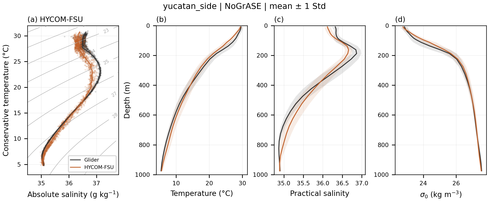
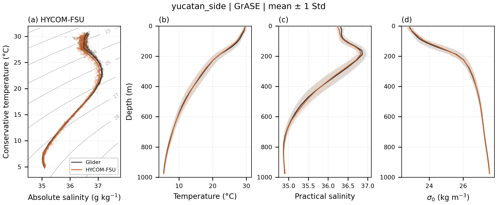
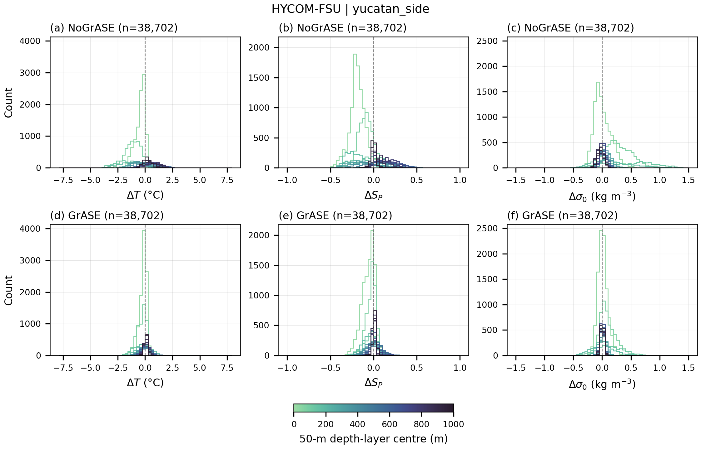

# HYCOM–Yucatan comparison

A complete comparison of HYCOM-FSU GrASE and NoGrASE with all four Yucatan-side glider missions:

- `sg651_20250428`
- `sg622_20250514`
- `sg650_20250817`
- `sg651_20250901`

The run includes eight model–mission pairs, each mission separately and the pooled `yucatan_side` group. All results use QC-processed `*_original_resolution.nc` observations, averaged here into six-hour UTC windows and native HYCOM depth bins. The existing `*_6hrstats.nc` means are not used. GrASE-assimilated observations are assimilation diagnostics rather than independent validation.

From the repository root, edit input paths in `config.json` and run:

```bash
grase-glider-compare run --config examples/hycom_yucatan/config.json --output results/hycom_yucatan
```

The configured `../../data/` paths resolve to the repository's `data/` folder. [Data share](https://drive.google.com/drive/folders/1MJ9wrgEqYmXIEWtJ25PRUQ3-RaIrC-T9?usp=drive_link). Update paths to your copies of the same model and glider files to reproduce the figures. Large input files and numerical caches are not included.

Differences are model minus glider. Profile shading is mean ± 1 standard deviation. Density is σ₀. The min–max NRMSD bounds are calculated from these eight HYCOM–Yucatan comparisons only.

Completed on 6 October 2026 with package version 1.2.0: **8 comparisons, 60 figures, no verification errors**. Pairing, coordinate order, physical/unit ranges and 300-dpi output checks passed. Each variant has 14,670, 14,564, 5,662 and 3,806 paired time–depth cells for the four missions listed above, respectively. These are paired cells, not independent casts.

[Browse all 60 figures](FIGURES.md).

### Pooled mean profiles





### Errors by depth


